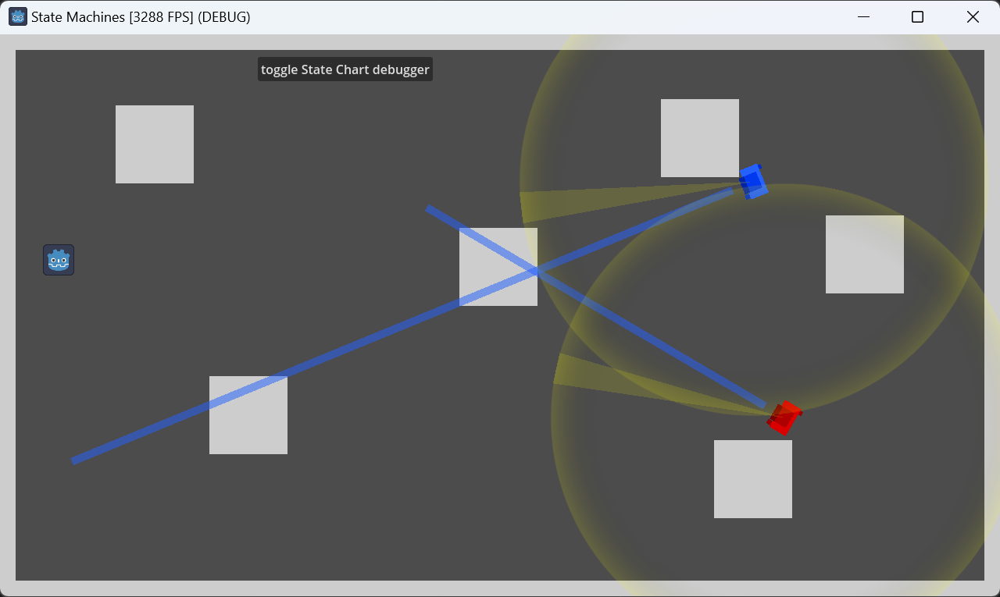

# Godot State Machines vs. State Charts

A simple comparison of a custom state machine vs. the [Godot State Charts](https://godotengine.org/asset-library/asset/1778) extension. The blue guard and player use a simple state machine and the red guard uses *Godot State Charts*.

Move with WASD or cursor keys.

Playable web version: https://toxe.itch.io/godot-state-machines-vs-state-charts
